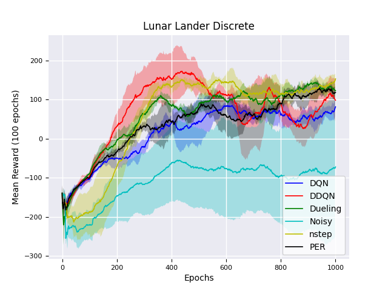

# Value-based DeepRL

This repository contains the value-based Deep Reinforcement Learning (DRL) methods that form the state-of-the-art Rainbow algorithm [1]. The proposed algorithms are separated into different folders to provide an easy-to-understand documented code (an algorithm relies only on dependencies in its folder), written in Tensorflow 2.

This repository is constantly being updated and represents a baseline for value-based DRL research.
It contains implementation of the following algorithms:

* Deep Q-Network (DQN) [2]
* Double DQN (DDQN) [3]
* Prioritized Experience Replay DQN (PDQN) [4]
* Dueling DQN [5]
* Nstep DQN [6]
* Noisy DQN [7]
* Distributed DQN (C51) [8]

### Results

The proposed approaches are evaluated over different seeds in the LunarLander environment. 
Follows our results of the performance (i.e., mean reward over 100 epochs) of the algorithms. Notice that we considered "common" hyperparameters for our evaluation, without any fine tuning (we omitted C51 from the results due to its poor performance without specific tuning).

  

### Requirements

* Python 3.x
* Installing the following packages:
	* Tensorflow 2, h5py, Yaml, Numpy, Gym
 
### Train the value-based algorithms

- Clone this repo to your local machine using `git clone ...`.
- Edit the `config.yml` file with your hyperparameters or desired environment
- Train the DRL approach using the `main.py` script.

## References

[1] [Rainbow: Combining Improvements in Deep Reinforcement Learning](https://arxiv.org/abs/1710.02298)
[2] [Playing Atari with Deep Reinforcement Learning](https://arxiv.org/abs/1312.5602)
[3] [Deep Reinforcement Learning with Double Q-learning](https://arxiv.org/abs/1509.06461)
[4] [Prioritized Experience Replay](https://arxiv.org/abs/1511.05952)
[5] [Dueling Network Architectures for Deep Reinforcement Learning](https://arxiv.org/abs/1511.06581)
[6] [Understanding Multi-Step Deep Reinforcement Learning: A Systematic Study of the DQN Target](https://arxiv.org/abs/1901.07510)
[7] [Noisy Networks for Exploration](https://arxiv.org/abs/1706.10295)
[8] [A Distributional Perspective on Reinforcement Learning](https://arxiv.org/abs/1707.06887)

## License

- **MIT license**
